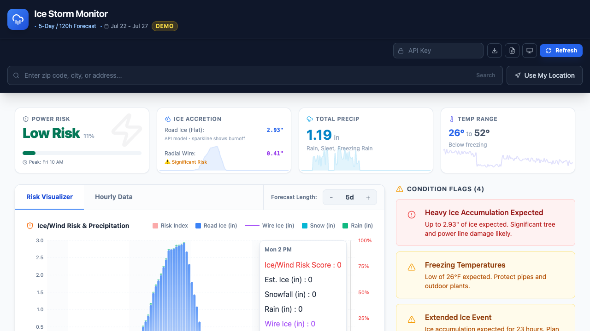

# Ice Storm Monitor

A small hobby dashboard for exploring hourly winter-weather data from the Google Weather API. It
turns forecast ice, temperature, precipitation, and wind data into simple condition flags and an
ice-and-wind risk score.

The score is a project-specific heuristic, not an official forecast or outage prediction. Use local
National Weather Service guidance and emergency alerts for real-world decisions.



## What it does

- Displays hourly ice, temperature, wind, and precipitation data.
- Highlights combinations that may be worth watching during freezing weather.
- Supports location search, browser geolocation, dark mode, and CSV/JSON export.
- Includes demo data so the interface can be explored without an API key.

This is a hobby project for watching local winter weather. Bug reports and small
improvements are welcome, but the calculations are not safety advice.

## Run locally

Requirements: Node.js 18 or newer and a Google Cloud project with the Weather API enabled.

```bash
git clone https://github.com/GoWithitRoger/Local-Google-Weather.git
cd Local-Google-Weather
npm ci
cp .env.example .env
npm run dev
```

Add your key to `.env`:

```bash
VITE_WEATHER_API_KEY=your_key_here
```

The key is used by browser code, so restrict it in Google Cloud to the required APIs and expected
website origins. The app also uses the Google Maps Geocoding API for location search.

## Development

```bash
npm run lint
npm run type-check
npm run build
```

## How the score works

The dashboard combines estimated radial ice accretion with wind thresholds to produce a relative
score from 0–100. The thresholds draw on common ice-storm impact categories, but the result has
not been calibrated as an outage probability.

The implementation lives in `src/utils/` and `src/constants/` so the assumptions remain visible and
easy to adjust.

## License

MIT. See [LICENSE](LICENSE).
